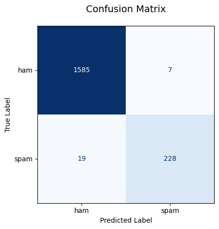
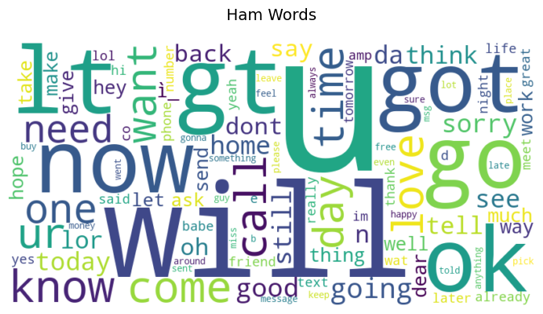

**[English Version / На английском](README.md)**

# SMS Spam Detector

Проект машинного обучения для бинарной классификации текстовых сообщений: спам или не спам.

## Возможности

- **Поддержка нескольких моделей**: Наивный Байес (по умолчанию) и Логистическая регрессия
- **Гибкая векторизация текста**: CountVectorizer или TfidfVectorizer с настраиваемыми параметрами
- **CLI-интерфейс**: Удобный запуск обучения через аргументы командной строки
- **Комплексная оценка**: Accuracy, F1, Precision, Recall, ROC-AUC + матрица ошибок
- **Интерпретируемость**: Облака слов и анализ ошибочно классифицированных примеров
- **Паттерны, готовые к использованию в рабочей среде**: Сохранение моделей и векторизаторов, структурированное логирование, обработка ошибок
- **Модульная архитектура**: Чёткое разделение ответственности между модулями данных, признаков, моделей, оценки и визуализации

## Быстрый старт

### 1. Клонирование и установка
```bash
# Клонируйте репозиторий
git clone https://github.com/IlyaShaposhnikov/sms-spam-detector.git
cd sms-spam-detector

# Создайте и активируйте виртуальное окружение
python -m venv venv
source venv/bin/activate  # Linux/macOS
# или
venv\Scripts\activate  # Windows

# Установите зависимости
pip install -r requirements.txt
```

### 2. Подготовка данных
Скачайте [датасет SMS Spam Collection](https://www.kaggle.com/datasets/uciml/sms-spam-collection-dataset) и поместите файл по пути:
```
data/raw/spam.csv
```

### 3. Обучение модели
```bash
# По умолчанию: Наивный Байес + CountVectorizer
python scripts/train.py

# С дополнительными параметрами
python scripts/train.py \
  --model logistic_regression \
  --vectorizer tfidf \
  --max-features 5000 \
  --test-size 0.25 \
  --output-dir my_experiment
```

## Расширенное использование

### Сохранение обработанных данных

Если вы хотите кэшировать предобработанные данные для ускорения повторного обучения или экспериментов:

```python
from src.data.loader import load_spam_data, save_processed_data

# Загрузка и предобработка
df = load_spam_data('data/raw/spam.csv')
# ... ваша кастомная предобработка здесь ...

# Сохранение в формате CSV или Parquet
save_processed_data(df, 'data/processed/cleaned.csv', file_format='csv')
# или
save_processed_data(df, 'data/processed/cleaned.parquet', file_format='parquet')
```

Загрузите данные позже без повторного парсинга исходного файла:

```python
import pandas as pd

# Для CSV
df = pd.read_csv('data/processed/cleaned.csv')

# Для Parquet (требуется pyarrow или fastparquet)
df = pd.read_parquet('data/processed/cleaned.parquet')
```

> **Зачем это нужно?**  
> - Ускорение итеративной разработки за счет пропуска повторного чтения и очистки данных  
> - Сохранение промежуточных результатов после кастомной предобработки (например, лемматизация, создание признаков)  
> - Формат Parquet обеспечивает лучшее сжатие и более быструю загрузку для больших датасетов

## Структура проекта

```
sms-spam-detector/
├── src/
│   ├── data/             # Модуль загрузки и очистки данных
│   ├── features/         # Векторизация текста
│   ├── models/           # Обучение моделей и предсказания
│   ├── evaluation/       # Расчёт метрик и матрица ошибок
│   └── visualization/    # Облака слов и анализ ошибок
├── scripts/
│   └── train.py          # Главный CLI-скрипт для обучения
├── data/
│   ├── raw/              # Исходные данные (игнорируются git)
│   └── processed/        # Обработанные данные (игнорируются git)
├── artifacts/            # Сохраненные модели, метрики, графики (игнорируются git)
├── logs/                 # Логи обучения (игнорируются git)
├── docs/                 # Изображения для документации README
├── .gitignore
├── requirements.txt      # Зависимости Python
├── README.md             # Документация проекта (английский)
└── README.ru.md          # Документация проекта (русский)
```

## Конфигурация

### Аргументы командной строки

| Аргумент | Значение по умолчанию | Описание |
|----------|----------------------|----------|
| `--data-path` | `data/raw/spam.csv` | Путь к входному CSV-файлу |
| `--test-size` | `0.33` | Доля данных для тестовой выборки (0.0–1.0) |
| `--vectorizer` | `count` | Метод векторизации: `count` или `tfidf` |
| `--max-features` | `2000` | Максимальное количество признаков для векторизатора |
| `--model` | `naive_bayes` | Тип модели: `naive_bayes` или `logistic_regression` |
| `--output-dir` | `artifacts` | Папка для сохранения артефактов |
| `--log-file` | `logs/training.log` | Путь к файлу лога |
| `--no-plots` | `False` | Пропустить генерацию визуализаций |
| `--random-state` | `42` | Seed для воспроизводимости результатов |

### Логирование

Логи одновременно выводятся в консоль и записываются в файл (`logs/training.log` по умолчанию) в формате:
```
2024-04-22 14:30:22 — INFO — Step 3/6: Training naive_bayes model...
```

> **Для пользователей Windows**: В логах пути могут отображаться с обратными слешами (`\`) вместо прямых (`/`). Это нормально и не влияет на работу программы.

## Ожидаемые результаты

Результаты могут незначительно варьироваться в зависимости от параметров `--max-features`, `--test-size` и случайного разбиения данных.
При настройках по умолчанию (`max_features=2000`, `test_size=0.33`):

| Метрика | Диапазон | Значение по умолчанию |
|---------|------------------|----------------------|
| Accuracy | 0.97–0.99 | **0.986** |
| F1 Score | 0.89–0.95 | **0.946** |
| Precision | 0.85–0.97 | **0.970** |
| Recall | 0.92–0.94 | **0.923** |
| ROC-AUC | 0.98–0.99 | **0.980** |

> Увеличение `--max-features` обычно улучшает F1 и Precision, но увеличивает время обучения.

## Визуализации

### Матрица ошибок (тестовая выборка)


*Тестовая выборка: 1 839 примеров | F1=0.946 | AUC=0.980*

### Облака слов
|  |  |

> Чем крупнее слово на облаке — тем чаще оно встречается в корпусе текстов.


## Автор

Илья Шапошников | [E-mail](mailto:ilia.a.shaposhnikov@gmail.com) | [LinkedIn](https://linkedin.com/in/iliashaposhnikov)

**[English Version / На английском](README.md)**